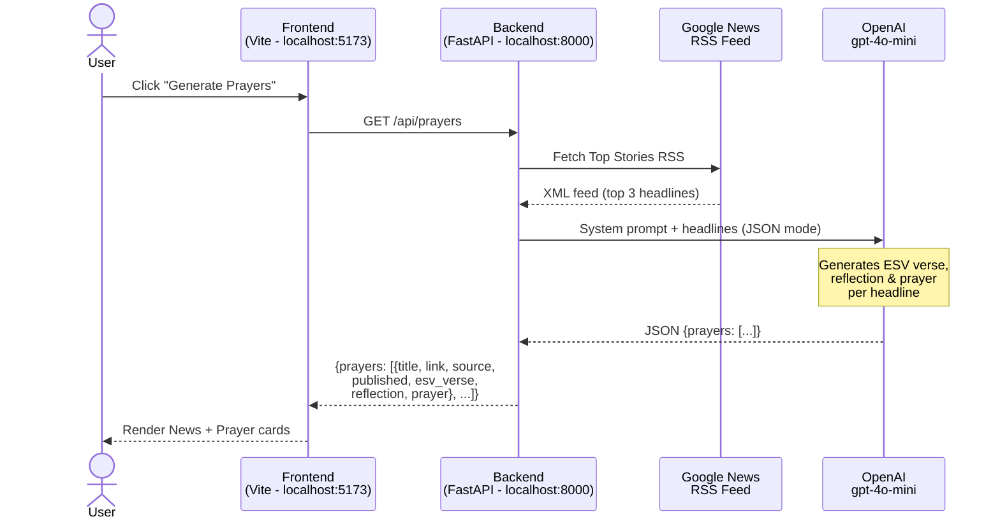

# Intercede - Daily Intercessory Prayer

> *"I urge that supplications, prayers, intercessions, and thanksgivings*
> *be made for all people...\" -- 1 Timothy 2:1 (ESV)*

An AI-powered prayer companion that fetches the top 3 news headlines,
reasons over them theologically, and generates Reformed Christian intercessory
prayers complete with relevant ESV Scripture.

## Flow Diagram



## Architecture

```text
intercede/
+-- backend/              # Python FastAPI
|   +-- .venv/            # Python virtual environment
|   +-- app.py            # API routes + CORS config
|   +-- news_service.py   # Google News RSS -> top 3 headlines
|   +-- prayer_service.py # OpenAI -> Reformed prayers
|   +-- requirements.txt
+-- frontend/             # Vite (vanilla JS)
|   +-- dist/             # Production build output
|   +-- index.html
|   +-- package.json
|   +-- src/
|       +-- main.js
|       +-- api.js
|       +-- newsCard.js
|       +-- prayerCard.js
|       +-- style.css
+-- start_app.ps1         # Launch both services (PowerShell)
+-- .env.example          # Environment variable template
```

## Quick Start

The easiest way to run both services at once:

```bash
.\start_app.ps1
```

This opens two titled terminal windows:

- **Intercede - Backend** at `http://localhost:8000`
- **Intercede - Frontend** at `http://localhost:5173`

## Manual Setup

### Step 1 - Add your OpenAI key

```bash
cp .env.example .env
# Then edit .env and add your OPENAI_API_KEY
```

**.env variables:**

| Variable         | Required | Default       | Description                   |
| ---              | ---      | ---           | ---                           |
| `OPENAI_API_KEY` | Yes      | —             | Your OpenAI API key           |
| `OPENAI_MODEL`   | No       | `gpt-4o-mini` | Override the OpenAI model     |

### Step 2 - Backend

```bash
cd backend
python -m venv .venv
.venv\Scripts\Activate.ps1
pip install -r requirements.txt
uvicorn app:app --reload --port 8000
```

The API will be at `http://localhost:8000`.

| Endpoint           | Description                        |
| ---                | ---                                |
| `GET /api/health`  | Health check                       |
| `GET /api/prayers` | Fetch headlines + generate prayers |

**`/api/prayers` response shape:**

```json
{
  "prayers": [
    {
      "title": "Headline text",
      "link": "https://...",
      "source": "Reuters",
      "published": "Sun, 01 Mar 2026 12:00:00 GMT",
      "esv_verse": "\"Verse text.\" — Book Chapter:Verse",
      "reflection": "2–3 sentence theological reflection.",
      "prayer": "Lord, you ordain all things for your glory..."
    }
  ]
}
```

### Step 3 - Frontend

```bash
cd frontend
npm install
npm run dev
```

Open `http://localhost:5173` in your browser.

**Frontend environment variable (production):**

Set `VITE_API_BASE_URL` in a `frontend/.env` file to point the frontend at a
deployed backend. Defaults to `http://localhost:8000` when not set.

```bash
VITE_API_BASE_URL=https://your-backend.onrender.com
```

## Deployment

The app is deployed on [Render](https://render.com):

| Service  | URL                                                                                  |
| ---      | ---                                                                                  |
| Frontend | `https://intercede-frontend.onrender.com`                                            |
| Backend  | Deployed on Render; URL not publicly listed. Configure `VITE_API_BASE_URL` instead.  |

The backend's CORS policy explicitly allows the Render frontend origin in
addition to `localhost:5173` and `localhost:3000` for local development.

## How It Works

1. **News**: Google News Top Stories RSS is parsed for the top 3 US headlines
   (free, no API key required). Each headline includes its `title`, `link`,
   `source`, and `published` date.
2. **Reasoning**: All 3 headlines are sent to `gpt-4o-mini` (configurable via
   `OPENAI_MODEL`) with a Reformed Christian system prompt that instructs the
   model to:
   - Begin each prayer with *"Lord, you ordain all things for your glory..."*
   - Reflect briefly on the headline's spiritual significance
   - Write a substantive intercessory petition for those affected
   - Include a relevant ESV Bible verse
   - Close with a doxological phrase
3. **Display**: The Vite frontend renders news + prayer cards side-by-side in a
   dark glassmorphism UI.
